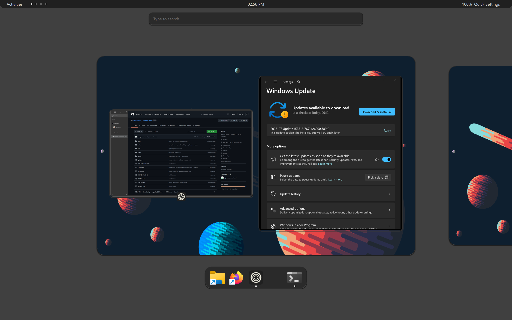
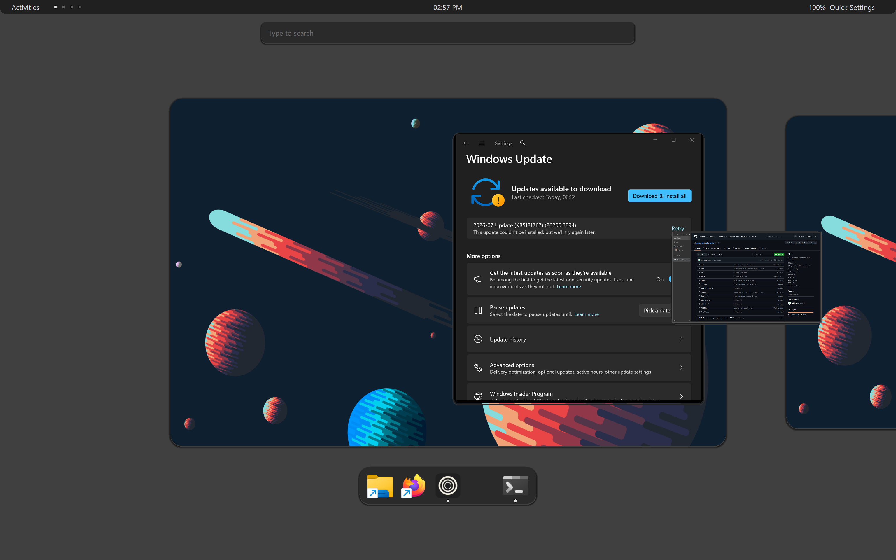

<p align="center">
  
</p>

# GroveShell

An experimental desktop shell for Windows 11, built around workspaces and an
Activities-style overview instead of the taskbar-and-Start-menu flow. Written
in Rust against the raw Win32 API.

While GroveShell runs, it draws its own bar along the top of the screen, hides
the Windows taskbar, and hands the taskbar's screen space back to your apps.
Workspaces sit one keystroke away. Quit it and everything comes back: the
taskbar, the work areas, and any windows it had parked. Explorer keeps running
underneath the whole time. Nothing here replaces system components, and there
is a watchdog plus a standalone recovery script for the day a bad build
misbehaves.



This is the overview: workspace cards with your actual wallpaper, window
previews with app icons, and a carousel you can drag between workspaces.
Opening zooms out of the current workspace. Closing zooms back into the one
you picked.



## What works today

- A top bar on every monitor: Activities button, workspace indicator dots, a
  clock with a calendar flyout, and a Wi-Fi/volume/battery status pill. It is
  per-monitor DPI aware and reserves its strip through the same AppBar
  mechanism the real taskbar uses.
- A GNOME-style Quick Settings panel behind that status pill (hover it for a
  highlight, click anywhere on it to open): Wi-Fi and Dark Mode toggle chips
  that actually flip the real system state (Wi-Fi radio via `wlanapi.dll`,
  theme via the same registry values Settings itself writes), a real
  draggable volume slider, and battery status with charging/low-battery
  states. Bluetooth, Airplane mode, Do Not Disturb, Night Light, and a
  brightness slider aren't in yet: the first four need either WinRT or
  fragile undocumented registry blobs, and brightness control is unreliable
  on laptop panels without WMI, so all of it is deferred rather than shipped
  half-working.
- GNOME-style workspaces. Each monitor is a pinned workspace, and a dynamic
  tail keeps one empty workspace at the end. `Ctrl+Alt+←/→` switches,
  `Ctrl+Alt+Shift+←/→` sends the focused window away. Windows on inactive
  workspaces are parked off-screen rather than hidden, with a snapshot taken
  at park time so previews don't go blank when apps stop rendering.
- Live window tracking. `SetWinEventHook` picks up new, closed, and renamed
  windows in the background, and switching to a parked window through
  Alt+Tab or the taskbar's own window list brings its workspace along with
  it. A small identity registry means a recycled window handle never
  inherits a dead window's workspace or preview.
- The Activities overview: fixed-size workspace cards in a draggable
  carousel. The focused card is a little larger than its neighbors, opening
  and closing animate as a zoom, and cards get rounded corners and drop
  shadows. Dragging a window's preview onto another card pops it out with a
  short animation and moves it there, and hovering any preview (or a dock
  icon) glows it so you can see what you're about to click. A search bar
  sits at the top the whole time the overview is open, ready for you to type
  and search open windows or installed apps. All of it is our own
  double-buffered GDI compositing.
- A dock along the bottom of the focused card, GNOME-dash style: appears
  only inside the overview, not as an always-visible taskbar. It mirrors
  your real Windows taskbar's pinned shortcuts and adds a running-indicator
  dot for anything currently open, pinned or not. A click focuses a running
  app or launches a pinned one.
- The Windows key remapped to Activities, GNOME-style: a plain tap opens or
  closes the overview instead of the Start Menu. Holding it down and
  left-dragging moves whatever window is under the cursor; holding it and
  right-dragging resizes that window from whichever corner you grabbed.
  Works on any window, not just this shell's own, through a pair of
  system-wide low-level hooks. Pushing the cursor into a monitor's
  top-left corner also opens the overview, the same hot-corner trigger
  GNOME uses.
- Taskbar replacement. The Windows taskbar is hidden and its reserved strip
  handed back to applications while GroveShell runs, then restored on exit.
  If a run dies without cleaning up, the next launch repairs it.
- A safety net: host and watchdog processes with heartbeats, a job object so
  child processes die together, and `scripts\recover.ps1`, which depends on
  nothing else working.
- A `groveshell-cli` for diagnostics: `ping`, `shutdown`, `list-windows`, and
  `list-monitors`.

## Roadmap

The full plan lives in [`docs/PROJECT_PLAN.md`](docs/PROJECT_PLAN.md) §16.
Condensed, with current status:

### Phase 0: Foundation and safety (done)
- [x] Cargo workspace, shared error and logging conventions
- [x] Single-instance host with named-pipe ping
- [x] Watchdog heartbeat and Explorer recovery
- [x] Structured rotating logs, standalone recovery script

### Phase 1: Window inventory (done)
- [x] Top-level window enumeration with an eligibility policy (visible, uncloaked, unowned, titled)
- [x] `SetWinEventHook` live tracking (create, destroy, show, hide, name change, foreground), debounced into the workspace model
- [x] Generation-counter `WindowId` identity across HWND reuse
- [x] `list-windows` / `list-monitors` CLI commands

### Phase 2: Global move/resize and hot corners (done)
- [x] Low-level mouse and keyboard hooks
- [x] Win+drag move and resize for any window
- [x] Hot-corner activation for the overview
- [x] Win key remapped to Activities

### Phase 3: Managed workspaces (partial)
- [x] Workspace domain model (pure, unit-tested) with the dynamic empty-tail policy
- [x] Pinned per-monitor workspaces plus a shared dynamic tail
- [x] Keyboard switching and move-window shortcuts
- [x] Park/unpark instead of hide/show, with crash recovery on the next start
- [ ] Session persistence across restarts
- [ ] Owned dialogs following their owner window

### Phase 4: Top bar and dock (partial)
- [x] Per-monitor top bars with AppBar work-area reservation
- [x] Activities button, workspace dots, clock, calendar
- [x] Per-monitor DPI scaling, rounded bottom corners
- [x] Windows taskbar hidden while running, restored on exit
- [x] Dock (pinned and running apps), overview-only, mirrored from the real taskbar's pins
- [x] GNOME-style Quick Settings: status pill with Wi-Fi/volume/battery glyphs, working Wi-Fi and Dark Mode toggles, draggable volume slider
- [ ] Bluetooth, Airplane mode, Do Not Disturb, Night Light toggles, and a brightness slider (need WinRT or undocumented registry blobs; deferred)
- [ ] Mirroring real system tray icons into the bar (feasibility being checked against this Windows 11 build's actual tray internals, which may need a different technique on newer builds)
- [ ] Central settings UI (bar height, keybindings, dock pin management)

### Phase 5: Activities overview (done)
- [x] Carousel layout engine with focused-card scaling
- [x] Window previews from our own captures, which survive apps that stop rendering off-screen
- [x] Zoom and fade open/close animations, smooth drag with snap
- [x] Click to focus, click empty space to switch or cancel
- [x] Dragging a window between workspaces in the overview, with pop in/out animations and a hover glow on previews and dock icons
- [x] Application and window search, always visible, not just while typing (type to search, Enter activates the top result)

### Phase 6: Hardening and accessibility
- [ ] Mixed-DPI and display-topology testing
- [ ] UI Automation semantics, keyboard-only traversal
- [ ] High-contrast and reduced-motion options
- [ ] Compatibility rules and ignore list

### Phase 7: Optional Explorer replacement
- [ ] Opt-in shell mode for a dedicated test account, with safe mode and full uninstall

## Building (Windows 11 x64, Rust stable)

```powershell
cargo build --workspace
cargo test --workspace
```

## Running

```powershell
.\scripts\dev-start.ps1
```

That builds everything and starts the watchdog, host, and UI as background
processes, with a small dashboard for pinging and shutting them down. Use the
dashboard's graceful shutdown rather than killing the processes: the UI
restores the Windows taskbar and un-parks windows in its close path.

## If something goes wrong

Run `.\scripts\recover.ps1`. It stops every `groveshell-*` process and makes
sure `explorer.exe` is running, without relying on any GroveShell binary
working correctly first. If a hard kill left the taskbar hidden, starting and
gracefully quitting GroveShell once also repairs it.

## Logs

Structured logs land in `%LOCALAPPDATA%\GroveShell\logs\`, one rotating file
per process: `host.log`, `watchdog.log`, `ui.log`, `cli.log`.

## Naming

This project started under a different name that leaned on the GNOME
trademark, and was renamed to GroveShell early on. GroveShell takes workflow
inspiration from GNOME Shell and nothing else: no GNOME code, assets, or
branding. It is independent and not affiliated with, sponsored by, or endorsed
by the GNOME Foundation.

## License

Dual-licensed under Apache-2.0 OR MIT. See `LICENSE-APACHE` and `LICENSE-MIT`.

## Design document

The full technical design, architecture, and phased roadmap lives in
[`docs/PROJECT_PLAN.md`](docs/PROJECT_PLAN.md). Architecture decisions are
recorded under [`docs/adr/`](docs/adr/).
