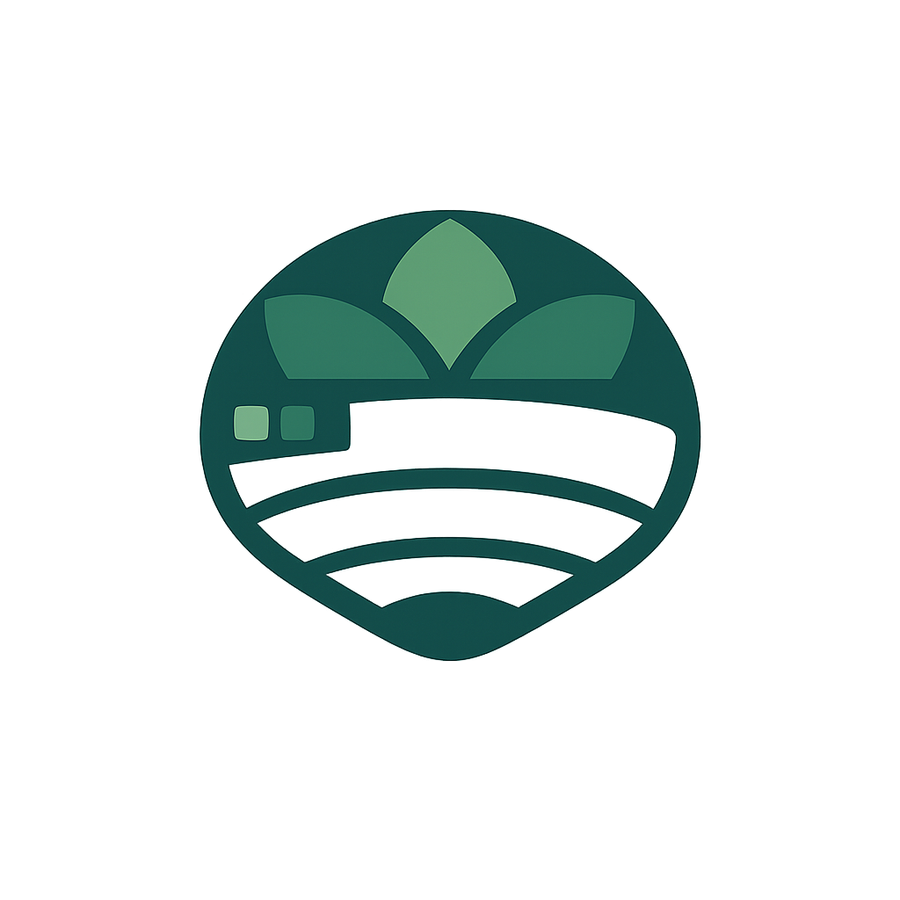
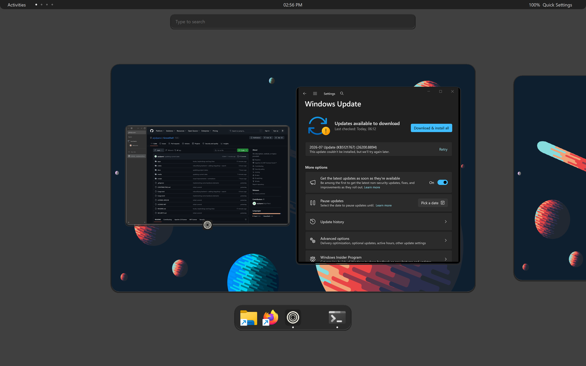
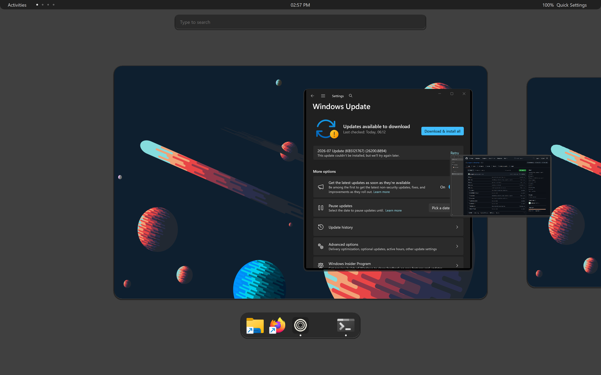

<p align="center">
  
</p>

# GroveShell

A workspace-focused desktop shell for Windows 11. Organize your apps across
independent workspaces, find anything from Activities, and keep everyday
controls within reach in a compact top bar.

GroveShell is written in Rust using Win32. It runs alongside Explorer and
restores the Windows taskbar and your windows when you quit. It is experimental
software; keep the recovery instructions below handy when trying a new build.



## Your desktop, organized

Open **Activities** to see your workspaces, live window previews, app search,
and a dock with your pinned and running apps. Click a preview to focus it,
search by typing, or drag a window onto another workspace card.

Each monitor has its own workspace set. Switching on one display leaves the
others alone. An empty workspace is always waiting at the end, and connecting
or disconnecting a monitor moves windows into a usable workspace automatically.



## A top bar for everyday tasks

Every monitor gets Activities and workspace indicators. The primary display
also has a clock and calendar, system status, settings, a power menu, and
access to the Windows notification area.

The **control center** provides Wi-Fi, Bluetooth, appearance, radio controls,
mute, and a draggable volume slider. Split-button arrows open additional
options: an in-panel Wi-Fi network list and saved connections, Bluetooth pairing,
themes, Windows airplane mode, audio devices, and the volume mixer. Network
selection for saved profiles happens inside GroveShell, with signal strength,
disconnect, refresh, and scrolling. New-network setup and password entry use
Windows' own connection UI; GroveShell does not collect or store Wi-Fi passwords.

The panel uses Segoe UI, rounded surfaces, the Windows accent color, hover
and keyboard focus feedback, and fade transitions that respect reduced
motion. Radio operations run in the background so they do not block painting.
Tab moves between controls, Enter or Space activates them, and arrow keys
adjust the focused volume slider. Escape goes back from options or dismisses
the panel.

Promoted notification icons are captured before Explorer's taskbar is hidden
and displayed in the primary bar. Left-click invokes
the app; right-click requests its context menu. The chevron opens Windows'
hidden icons. Windows 11 stops rendering its XAML tray while hidden, so inline
images retain their last captured appearance. New icons and badge changes
require another capture while Explorer's taskbar is visible, or a shell restart.

## Make it yours

Open the gear in the top bar to configure bar height, dock placement and
behavior, overview appearance, input, and accessibility. Choose an
overview-only dock, an always-visible dock, or an auto-hiding desktop dock.
Appearance changes apply while GroveShell is running.

The shell follows the Windows accent color and supports high contrast,
reduced motion, and per-monitor DPI scaling. Compatibility rules can exclude
apps from workspace management. See the [compatibility notes](docs/compatibility.md)
for tested configurations and remaining hardware checks.

## Keyboard and mouse

| Action | Shortcut |
| --- | --- |
| Open or close Activities | Tap the Windows key |
| Switch workspace on the focused monitor | Ctrl + Alt + Left / Right |
| Move the focused window to another workspace | Ctrl + Alt + Shift + Left / Right |
| Move a window | Windows key + left-drag |
| Resize a window | Windows key + right-drag |
| Search apps and windows | Type in Activities; Enter opens the top result |
| Open Activities with the mouse | Click Activities or use the top-left hot corner |

## Build and run

Requires **Windows 11 x64** and **Rust stable** with the MSVC toolchain and
Windows SDK / Visual Studio C++ build tools.

```powershell
cargo build --workspace
cargo test --workspace
.\scripts\dev-start.ps1
```

The development launcher builds the workspace and starts the watchdog, host,
and UI in the background, with a dashboard for status and graceful shutdown.
Use graceful shutdown to restore the taskbar, work areas, and parked windows.

## Recovery and diagnostics

If the shell becomes unresponsive, run:

```powershell
.\scripts\recover.ps1
```

Recovery stops GroveShell processes and ensures Explorer is running without
depending on a working GroveShell binary. Starting and gracefully quitting
GroveShell also repairs a taskbar left hidden by a hard kill.

The host and watchdog monitor process health. Structured, rotating logs live
in `%LOCALAPPDATA%\GroveShell\logs\`. The CLI provides `ping`, `shutdown`,
`list-windows`, `list-monitors`, and `diagnostics`; diagnostics support
window-title redaction. Telemetry is off by default.

## Current limitations

- Workspace assignments do not persist across restarts.
- The radio tile switches available radios together; it is not Windows'
  airplane-mode flag. Its options open the actual Windows setting.
- Brightness, Night Light, and Do Not Disturb are not integrated controls.
- Tray images are snapshots; app menu behavior varies across Explorer builds.
- Wi-Fi enumeration can require Windows location permission. The panel keeps
  access to Windows' network UI available when enumeration is denied.
- Full Narrator, mixed-monitor hardware, and long-soak validation remain
  ongoing. Painted keyboard controls do not yet expose a complete UI
  Automation accessibility tree.

## Development

See [CONTRIBUTING.md](CONTRIBUTING.md) for contribution guidance,
[the design document](docs/PROJECT_PLAN.md) for architecture and future work,
and [architecture decisions](docs/adr/) for the reasoning behind the design.

GroveShell takes workflow inspiration from GNOME Shell, using no GNOME code,
assets, or branding. It is not affiliated with or endorsed by the GNOME
Foundation. Interface icons are from [Lucide](https://lucide.dev), with their
license included in `apps/ui/resources/icons/NOTICE.md`.

Dual-licensed under [Apache-2.0](LICENSE-APACHE) or [MIT](LICENSE-MIT).
