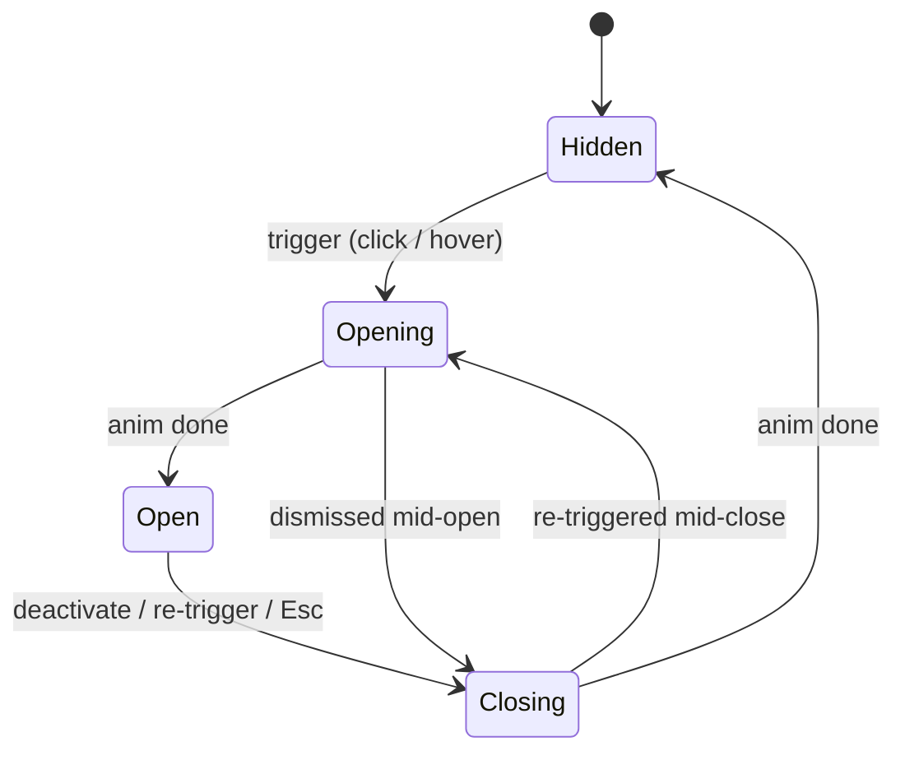
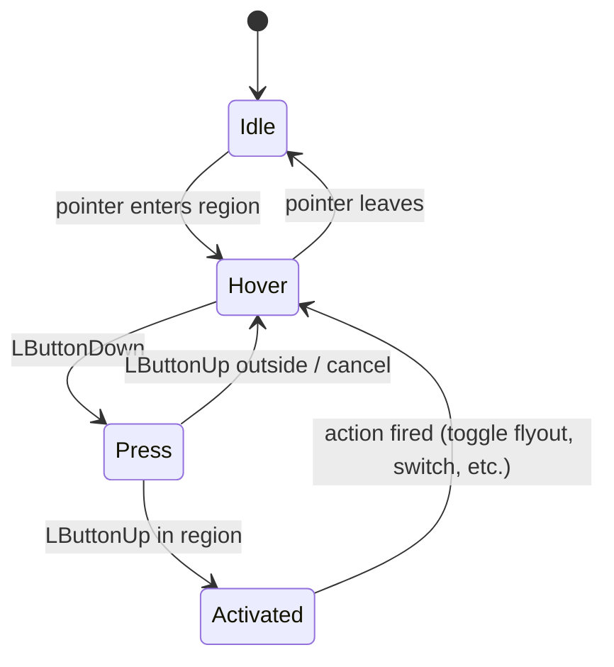
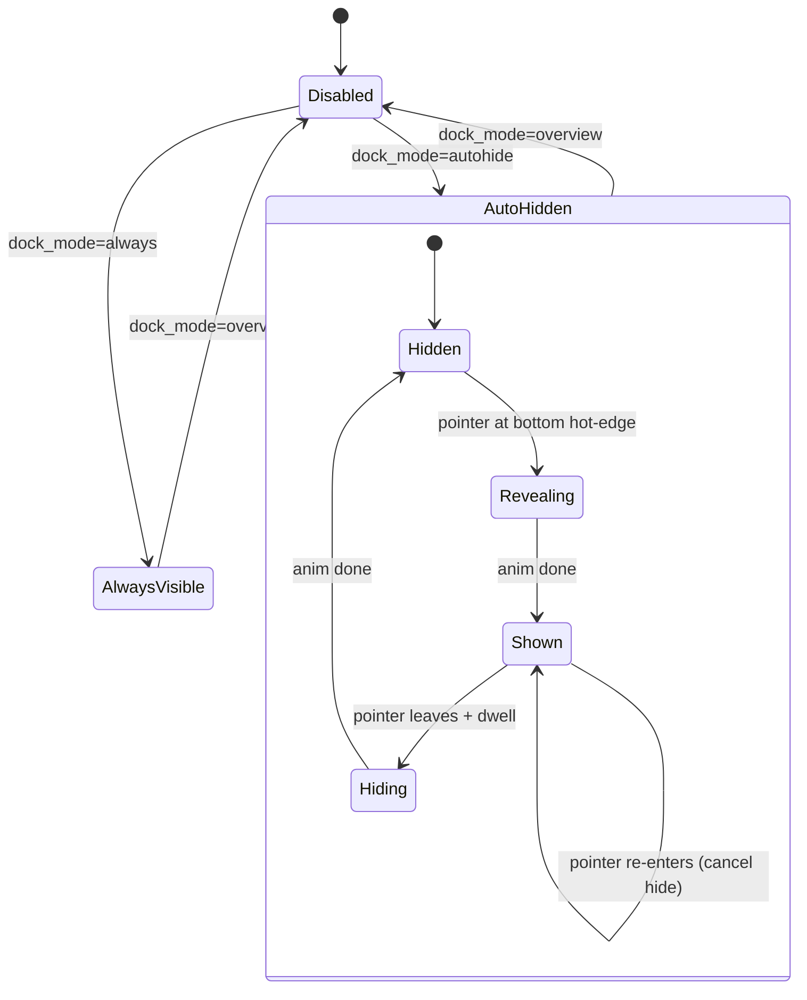
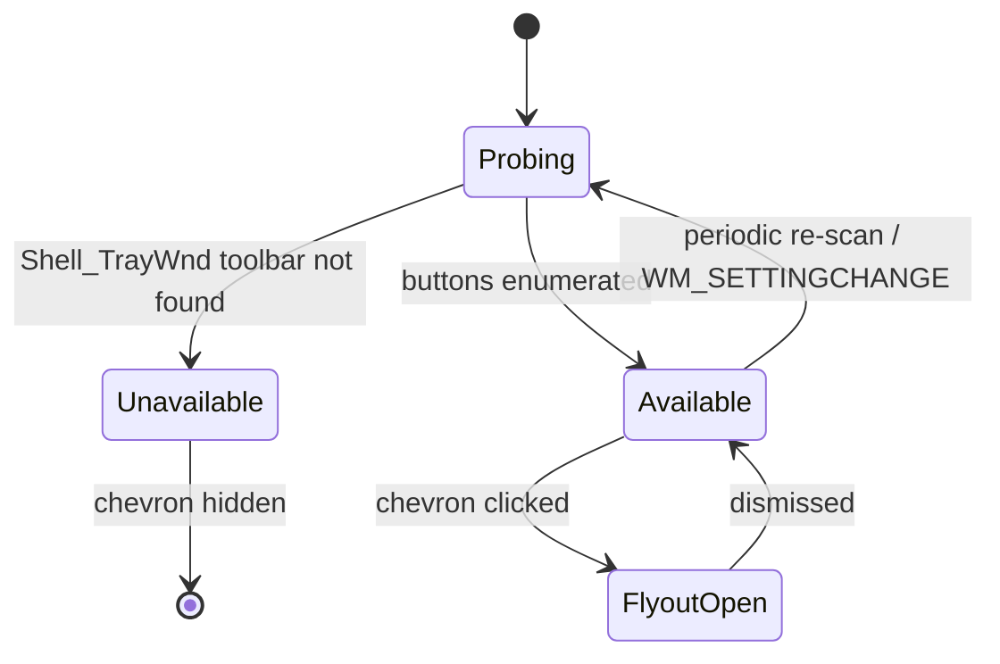
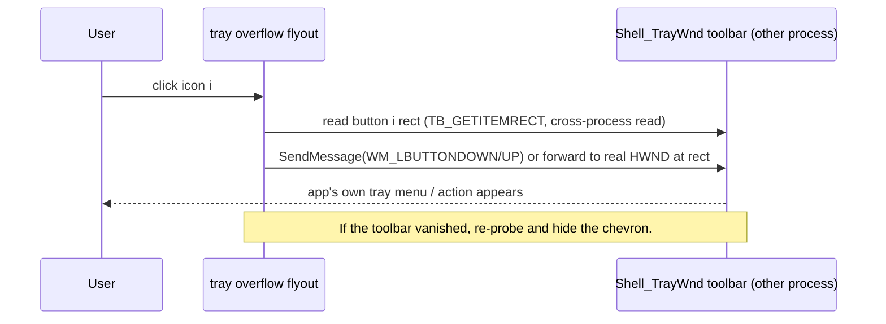
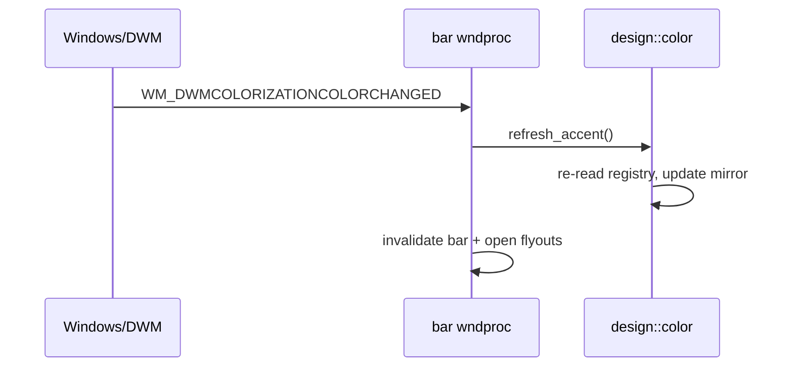

# Phase 4 Finish — Unified Shell UI, Design Language & Remaining Features

**Status:** Approved design — not an implementation guarantee.
**Plan reference:** `docs/PROJECT_PLAN.md` §10 (Shell user interface: top bar, dock),
§7 (tray integration), §16 roadmap Phase 4 exit criteria.
**Goal:** Close out Phase 4 by (1) unifying every shell surface under one design
language and motion system that reads as native Windows 11 with a modern edge,
and (2) landing the remaining functional gaps — system-tray hosting, a
session/power menu, opt-in desktop dock modes, and a notifications indicator.

## 1. Decisions locked in brainstorming

| Decision | Choice |
|---|---|
| Scope | Comprehensive: full design/motion overhaul **and** all remaining features. |
| System tray | Curated indicators + best-effort **overflow** hosting the real tray's icons; degrade gracefully on newer builds. |
| Accent color | Follow the live **Windows accent** (registry), with a fallback constant if the read fails. |
| Material | Subtle **Mica-like** translucency on bar + flyouts (not heavy acrylic, not flat). |
| Motion | One shared easing/duration system, gated by `reduced_motion`, scaled by `animation_scale`. |
| Desktop dock | Build `always` / `autohide` as **opt-in** modes; `overview` stays the default. |
| Notifications | Bell **indicator + flyout** only; no live WinRT listener this pass (deferred). |

## 2. Context / actors

```mermaid
graph TB
    User([User])
    subgraph GroveShell UI process
        Bar[Top Bar]
        Flyouts[Flyouts: Quick Settings / Calendar+Notifications / Session / Tray Overflow]
        DeskDock[Desktop Dock]
        OverviewDock[Overview Dock]
        Design[design:: color / metrics / motion tokens]
        MotionDrv[Animation tick driver]
    end
    Windows[(Windows: DWM / Registry / Shell_TrayWnd / Power)]
    Config[(groveshell-config)]
    Settings[groveshell-settings]

    User -->|hover / click / hot-edge| Bar
    User --> Flyouts
    User --> DeskDock
    Bar --> Flyouts
    Bar -->|reads tokens| Design
    Flyouts --> Design
    DeskDock --> Design
    OverviewDock --> Design
    Design -->|accent, colorization| Windows
    Bar -->|TB_GETBUTTON / forward click| Windows
    Flyouts -->|Lock / Logoff / Shutdown| Windows
    MotionDrv --> Bar
    MotionDrv --> Flyouts
    MotionDrv --> DeskDock
    Config -->|dock_mode, reduced_motion, animation_scale, high_contrast| GroveShell UI
    Settings -->|config.reload IPC| GroveShell UI
```

## 3. Design system (the backbone)

New module set under `apps/ui/src/imp/design/` (evolves the Phase 6 `palette.rs`,
which is folded into `design::color` and deleted). Every existing hard-coded
color/radius/duration literal in `bar.rs`, `calendar.rs`, `quick_settings.rs`,
`dock.rs`, and `overview*.rs` is migrated to a token. No surface keeps private
copies of these values.

### 3.1 `design::color`

| Token | Dark value | High-contrast | Notes |
|---|---|---|---|
| `surface_base` | `#1E1E1E` | `#000000` | Bar fill (under Mica). |
| `surface_raised` | `#262626` | `#000000` | Flyout cards. |
| `surface_overlay` | `#2E2E2E` | `#1A1A1A` | Menus, hover chips. |
| `text` | `#E8E8E8` | `#FFFFFF` | Primary. |
| `text_muted` | `#9A9A9A` | `#C8C8C8` | Secondary. |
| `stroke` | `#3A3A3A` | `#FFFFFF` | 1px hairline borders. |
| `accent` | *live* | `#FFFF00` | From registry; fallback `#4CC2FF`. HC yellow matches Phase 6. |
| `accent_text` | `#FFFFFF` | `#000000` | Text on accent fills. |

Colors are written above in conventional `#RRGGBB` web notation for readability;
each is stored/used as a Win32 `COLORREF` (byte-swapped to `0x00BBGGRR`) via one
`rgb()` helper, so there is exactly one conversion site. The high-contrast accent
is yellow to match the palette shipped in Phase 6. High-contrast branching reuses
the Phase 6 `state::high_contrast()` mirror. This pass keeps the dark shell (a
light-theme shell is out of scope, noted as follow-up).

**Live accent** (`accent()`):
- Read `HKCU\Software\Microsoft\Windows\DWM\AccentColor` (a `DWORD` in `AABBGGRR`);
  strip alpha, convert to `COLORREF`. If absent, try `ColorizationColor`. If both
  fail, use the fallback constant.
- Cached in a re-entrancy-safe thread-local mirror (same pattern as the Phase 6
  `HIGH_CONTRAST` mirror) so paint code deep inside a `STATE` borrow can read it.
- Refreshed on `WM_DWMCOLORIZATIONCOLORCHANGED` and `WM_SETTINGCHANGE`, which then
  invalidates the bar + open flyouts.

### 3.2 `design::metrics`

```
radius_chip   = 8      spacing unit  = 8 (grid)
radius_card   = 12     stroke_width  = 1
shadow: blur 18, offset (0, 6), 40% black   // one flyout/card shadow spec
```

### 3.3 `design::motion`

```
Duration  fast = 180ms   base = 250ms   (before scaling)
Easing    ease_out_cubic(t) = 1 - (1-t)^3
          ease_in_out_cubic(t) = t<.5 ? 4t^3 : 1-(-2t+2)^3/2

effective_ms(named) = if reduced_motion { 0 } else { named * animation_scale }
```

Built on the existing `util::progress_dur` + `state::animation_config()` infra.
`reduced_motion` makes every transition resolve instantly (start == end state),
never a broken half-state. Pure easing functions are unit-tested.

## 4. Component inventory

| Component | Responsibility | Key interface | Depends on | Owns state |
|---|---|---|---|---|
| `design::color/metrics/motion` | Token source of truth | pure getters | `state` (accent/HC mirrors) | accent cache |
| `bar` | Paint bar, route hover/click to regions | `paint_bar`, `on_bar_hover/click` | design, all flyouts, tray, session | hovered region, press anim |
| `flyout` (new shared) | One open/close lifecycle + anim + dismiss | `FlyoutState`, `open/close/tick` | design::motion | phase, progress |
| `quick_settings` | System toggles + sliders | existing, re-skinned | flyout, design | toggle states |
| `calendar` (+notifications) | Month grid + notifications list | existing + bell entry | flyout, design | selected date |
| `session_menu` (new) | Power/session actions | `open`, `on_click`, `execute` | flyout, design, Windows power | — |
| `tray` (new) | Read real tray buttons, render, forward clicks | `enumerate`, `paint_overflow`, `forward_click` | design, Shell_TrayWnd | cached button list |
| `dock` (overview) | Icon-row layout + paint + interactions | refactor: extract `dock_render` | design | pins, drag |
| `desktop_dock` (new) | Persistent dock window in always/autohide | `create`, `paint`, reveal SM | dock_render, design, AppBar | mode, reveal phase |
| `motion tick` | Drive all in-flight animations | `on_animation_tick` | every animated component | active anims |

## 5. State machines

### 5.1 Shared flyout lifecycle (Quick Settings, Calendar, Session, Tray overflow)


Opening/Closing animate scale `0.96↔1.0` + opacity `0↔1` from the anchor edge.
`reduced_motion` collapses Opening/Closing to instant.

### 5.2 Top-bar region interaction


Hover highlight fades in over `fast`; Press applies a subtle scale-down.

### 5.3 Desktop dock


`AlwaysVisible` reserves a bottom AppBar strip (like the top bar reserves the top);
`AutoHidden` reserves nothing and slides in/out over `base`.

### 5.4 Tray overflow



## 6. Key sequences

### 6.1 Tray overflow click forwarding



### 6.2 Live accent change



## 7. Feature detail

**Session/power menu.** Anchored under a session glyph at the far right.
Actions: Settings (spawn `groveshell-settings`), Lock (`LockWorkStation`),
Sign out (`ExitWindowsEx EWX_LOGOFF`), Sleep (`SetSuspendState`), Restart
(`EWX_REBOOT`), Shut down (`EWX_SHUTDOWN`). Restart/Shut down/Sign out show an
inline confirm row. Shutdown/reboot acquire `SE_SHUTDOWN_NAME` first; failure is
surfaced, never a silent no-op.

**Desktop dock modes.** `dock_render` is extracted from the overview `dock.rs`
(icon layout, hit-test, paint, running dots) so both the overview dock and the
new `desktop_dock` window share one renderer — no duplicated icon logic. The
desktop dock is a `WS_POPUP` layered window; `always` registers a bottom AppBar,
`autohide` uses a 1px bottom hot-edge + dwell timer. Pin/launch/focus behavior is
identical to the overview dock.

**Notifications indicator.** A bell glyph left of the indicator pill; clicking
opens the calendar flyout scrolled to a notifications section (placeholder list +
"no live notifications yet" copy). No WinRT listener — deferred, documented.

## 8. Risks & degradation

| Risk | Mitigation |
|---|---|
| Tray toolbar absent on XAML-island builds | Probe returns `Unavailable`; chevron hidden; curated indicators still work. |
| Cross-process click forwarding unreliable | Best-effort; documented; never crashes the bar if it fails. |
| Accent read fails | Fallback constant; refresh handler still wired. |
| Mica hurts contrast over busy wallpaper | Subtle blur only; text keeps a solid backing plate where needed. |
| Always-dock work-area reservation fights apps | Opt-in only; default unchanged; AppBar unregistered when mode leaves `always`. |
| STATE re-entrancy (known recurring crash) | All new config reads go through thread-local mirrors, per project memory. |

## 9. Testing

- **Unit:** easing functions, `effective_ms` scaling/reduced-motion, accent
  `DWORD`→`COLORREF` conversion, flyout phase transitions, dock reveal SM, tray
  button-rect math — all pure, no Windows calls.
- **Build/smoke:** `cargo build --workspace`, `cargo test --workspace
  --no-fail-fast` (the config `save` tests fail environmentally on this machine —
  see project memory — not a regression).
- **Visual sign-off:** run the real shell and screenshot each surface (light proof
  the browser mockups can't give for a native app).

## 10. Commit sequence (each buildable)

1. This spec.
2. `design::` foundation (color tokens + live accent + metrics + motion) + unit
   tests; fold in `palette.rs`; no visual change yet beyond accent.
3. Migrate bar/calendar/quick-settings/overview to tokens; apply Mica material +
   flyout grow-from-anchor motion (design language becomes visible).
4. Shared `flyout` lifecycle module; re-home Quick Settings/Calendar onto it.
5. Tray: curated indicator layout + overflow probe/render/forward + chevron.
6. Session/power menu.
7. Desktop dock: extract `dock_render`, add `desktop_dock` window + always/autohide.
8. Notifications indicator + flyout section.
9. Docs: README Phase 4 checklist, `docs/compatibility.md` note, PROJECT_PLAN progress.

## 11. Out of scope (explicit)

Live notification listener/center; light-theme shell; Do Not Disturb / Night
Light / brightness (no public API — already deferred in README); a full
literal tray mirror with perfect click fidelity.
